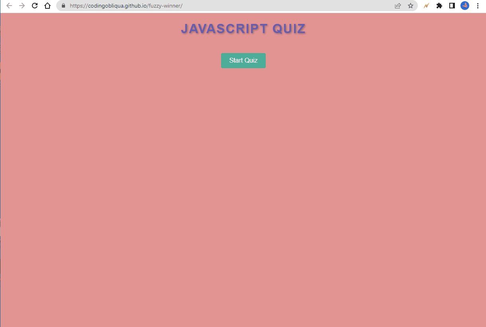

# fuzzy-winner

## Description

The Code A Quiz project is a application that allows users to take a quiz to test their knowledge of JavaScript. The project includes A functional start button, with a timer, and a question. At the end the user can save their initials and score.

- Implementing timers and dynamically changing content based on user interactions.
- Managing question flow and tracking user progress within the quiz.
- Incorporating validation and feedback mechanisms for correct and incorrect answers.
- Storing and retrieving user data, such as initials and scores.
- Enhancing user experience through interactive design and intuitive interface.

Overall, the project enhanced understanding and proficiency in web development, JavaScript programming, and user interface design.

Link to the page: https://codingobliqua.github.io/fuzzy-winner/

## Installation
First step is to open github and create a new repository for Challenge 4 (Give the repo a unique name to help differ it from other projects), Open the files folder and open the newly made repo, There should be nothing but the read.me. Search the files for the UCB bootcamp file (in the same page or new one). The starter code should now be in the folder and be accessible. If no starter code you must create the code from scratch. Create a page using HTML, CSS, JavaScript to display a functional quiz. 
## Usage
To use the Code Quiz application, follow these steps:

/ Open the web page or application where the Code Quiz is hosted.
/ Click on the "Start" button to begin the quiz.
/ A timer will start counting down, and the first question will be presented.
/ Read the question carefully and choose the correct answer from the provided options.
/ Click on your chosen answer to submit your response.
/ If your answer is correct, you will move on to the next question. If it is incorrect, time will be subtracted from the timer.
/ Continue answering questions and advancing through the quiz.
/ The game will end either when all questions are answered or when the timer reaches 0.
/ After the game ends, you will be prompted to enter your initials and save your score.
/ Enter your initials in the designated field and click on the "Save" button.
/ Your initials and score will be recorded for future reference.
/ You can play the quiz again by clicking on the "Restart" button.
/ Enjoy the Code Quiz and challenge yourself to test your coding knowledge!
## Credits
UCB ED.x Andres Asencios (CodingObliqua)
## Features

A functioning quiz that displays high scores and resets for multiple attempts.

